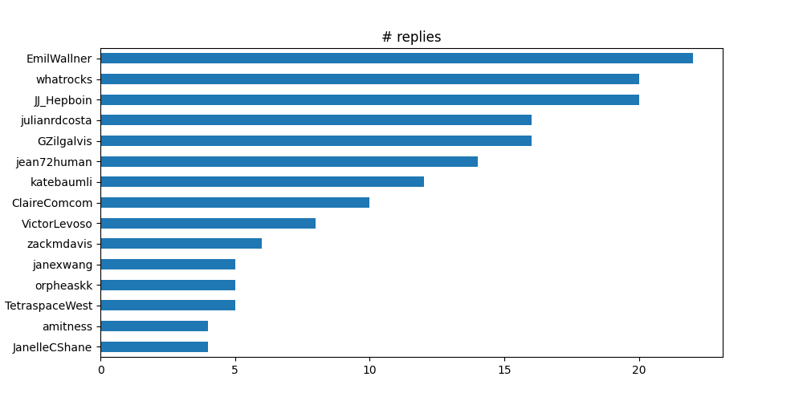

# Reply gang

>Who replies to your tweets?

## Getting started

1) create [Twitter developer account](https://developer.twitter.com/en/apply-for-access).

2) install the [command-line power tool for Twitter](https://github.com/sferik/t), aka "t".

3) download data: `t replies -n 500 -c > data.csv`

4) install dependencies: `pip install pandas matplotlib`

5) plot your data: `python plot.py`

## Result

